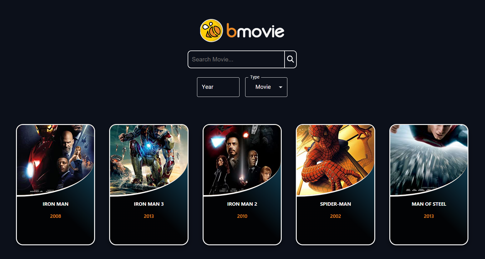

# bmovie App

A simple react web application to find movies & series.
OMDB API was used to fetching data.

## To run the apllication

Open a terminal,navigate to root folder and run the commands below 
```
npm install
```
```
npm start
```
### using the bmovie app



User can search for a movie or series based on movie title and date.
The user also has the ability to add or remove each movie to a favorite list. By clicking on the movie the user can see more information about it.

